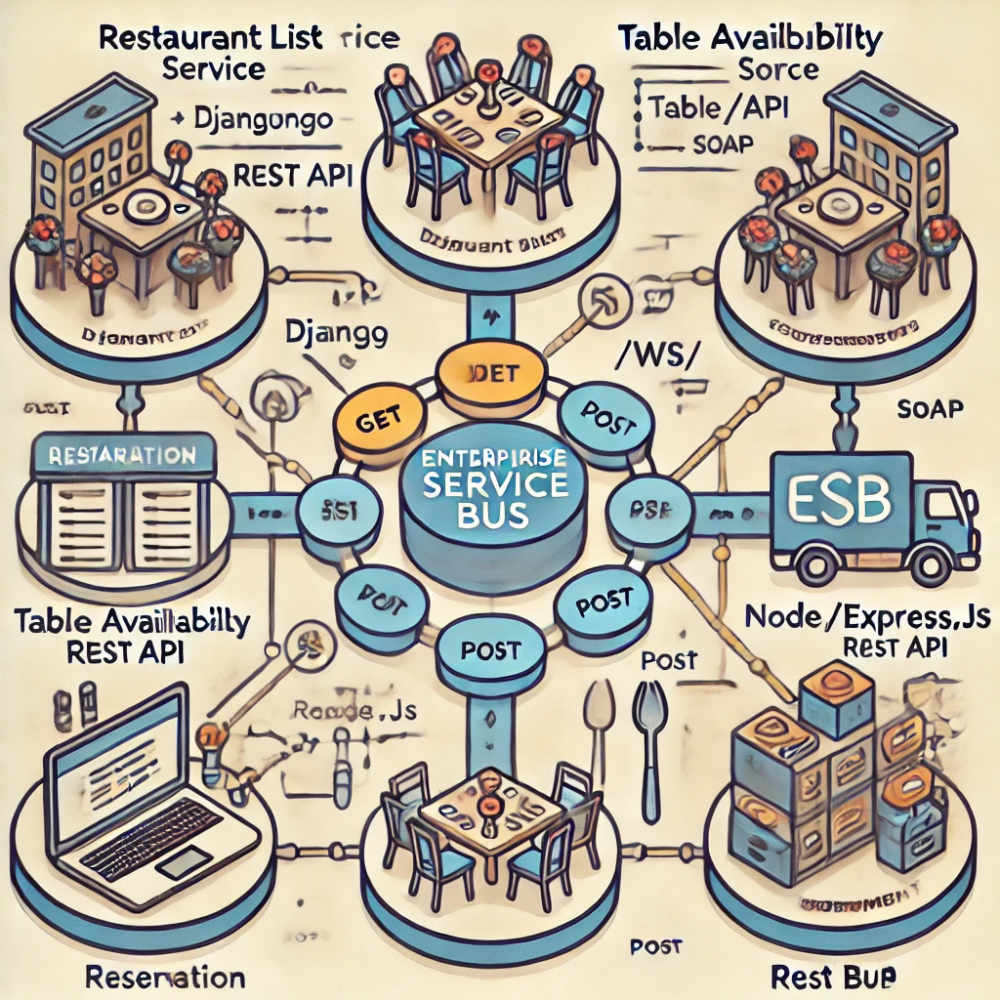
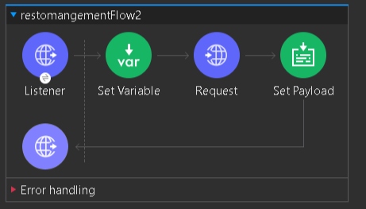
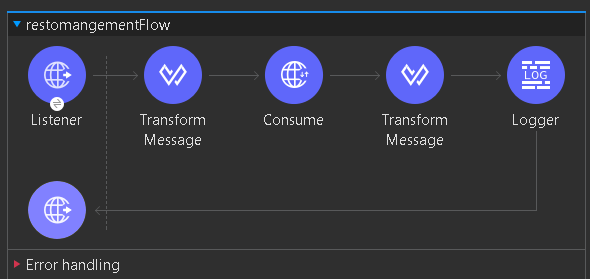
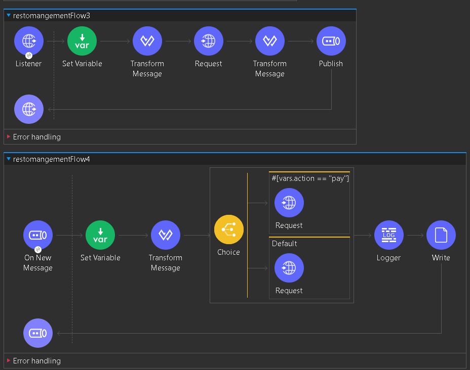

# **Restaurant Reservation System**


## **Overview**
This repository demonstrates a service-oriented architecture (SOA)-based restaurant reservation system, integrating multiple independent services using REST and SOAP protocols. The system employs an Enterprise Service Bus (ESB) concept to streamline communication between services, ensuring efficient data flow and interoperability.

### **Key Features**
1. **Modular Design with ESB Integration**: Each service is designed as a standalone module, communicating seamlessly via an ESB to ensure a robust and scalable architecture.
2. **Technology Diversity**: Demonstrates interoperability with services implemented using Django, Spring Boot, Node.js/Express.js, and MySQL.
3. **Comprehensive Workflow**: Covers the entire reservation process, from listing restaurants to confirming payments.

### **Components**
1. **Restaurant List Service** (Django)
   - Provides restaurant information through REST APIs.
2. **Table Availability Service** (Spring Boot)
   - Offers SOAP-based APIs to query table availability with filtering options.
3. **Reservation Service** (Node.js/Express.js)
   - Handles reservation creation and status management.
4. **Payment Service** (Node.js/Express.js)
   - Manages payment processing and updates reservation statuses.

---

## **Enterprise Service Bus (ESB) Architecture**
The ESB acts as the central communication hub for all services, enabling message transformation, routing, and orchestration. The flow of operations within the system is as follows:

1. **Restaurant Listing**:
   - The client sends a request to the ESB.
   - The ESB routes the request to the Restaurant List Service (Django) to retrieve available restaurants.

2. **Table Availability Check**:
   - The ESB forwards the client's query to the Table Availability Service (Spring Boot).
   - The service responds with filtered table options.

3. **Reservation Creation**:
   - The ESB directs the reservation details to the Reservation Service (Node.js/Express.js).
   - A reservation entry is created, with the status initially set to "not confirmed."

4. **Payment Processing**:
   - The ESB routes the payment request to the Payment Service (Node.js/Express.js).
   - The reservation status is updated to "paid" upon successful payment or "canceled" if the payment fails.

---


## **Repository Structure**
```
restaurant-reservation-system/
|
├── RestaurantListWebService/      # Django-based Restaurant List Service
|
├── TableAvailability/      # Spring Boot-based Table Availability Service
|
├── ReservationWebService/         # Node.js-based Reservation Service
|
├── Payment/                # Node.js-based Payment Service
|
├── ESB-Bus-MuleProject/                           # MuleProject
|
└── screenshots/                          # Screenshots for the Mule project
|
└── Database/   the MySQL database file
|
└── Bus-Config.xml/   ESB mule configuration file
```
## **Mule Project Overview**

The Mule Project acts as the **Enterprise Service Bus (ESB)**, coordinating communication between services. MuleSoft simplifies service orchestration by using various components to route, transform, and handle messages efficiently. Below is an explanation of the key components used in this project:

### **Key Mule Components**

1. **HTTP Listener**:
   - Acts as the entry point for incoming requests from clients.
   - Listens for HTTP requests and forwards them to the appropriate flow or service.

2. **HTTP Request**:
   - Sends requests to external services or APIs.
   - In this project, it is used to communicate with the Restaurant List Service, Table Availability Service, Reservation Service, and Payment Service.

3. **Message Transformer**:
   - Processes and transforms incoming messages into the required format for the target service.
   - Example: Converts XML payloads into JSON or vice versa, ensuring service compatibility.

4. **JMS Publish and Consume**:
   - **Publish**: Sends messages to a JMS queue for asynchronous communication.
   - **Consume**: Listens for messages from the JMS queue and processes them.
   - Enables decoupled communication, improving system scalability.

5. **Logger**:
   - Records messages or events for debugging and monitoring purposes.
   - Used extensively to track the flow of data between services and log errors or important events.

6. **Choice Router**:
   - Routes messages to different flows or endpoints based on specific conditions.
   - Example: Directs payment-related requests to the Payment Service and reservation-related requests to the Reservation Service.

7. **Error Handler**:
   - Catches and handles exceptions that occur during message processing.
   - Configured to return appropriate error responses or retry operations when necessary.

8. **On New Message**:
   - Triggers an event whenever a new message is published to a JMS queue or other messaging systems.
   - In this project, used to monitor specific events like new reservations or payment updates.

---

### **Mule Flows**

1. **Restaurant List Flow**:
   - Accepts client requests for restaurant data via the HTTP Listener.
   - Forwards the Restaurant List Service request using an HTTP Request component.
   - Transforms and returns the response to the client.

2. **Table Availability Flow**:
   - Accepts requests to check table availability.
   - Communicates with the Table Availability Service (SOAP-based) using the HTTP Request component.
   - Transforms SOAP responses into JSON for client consumption.

3. **Reservation & Payment Flow**:
   - Handles reservation creation and payment confirmation.
   - Uses the HTTP Request to communicate with the Reservation Service and Payment Service.
   - Publishes messages to a JMS queue for asynchronous processing and updates.

4. **Error Handling Flow**:
   - Configures custom error responses for client requests in case of service failures.
   - Ensures the client receives meaningful error messages and prevents data corruption.

---

### **Benefits of Using MuleSoft ESB**

- **Centralized Communication**: Simplifies the interaction between distributed services.
- **Scalability**: Decoupled architecture enables easy addition of new services or changes to existing ones.
- **Data Transformation**: Seamlessly handles data format conversion between services (e.g., XML to JSON).
- **Error Management**: Provides robust error-handling mechanisms to ensure system reliability.

---

### **Screenshots of MuleSoft Flows**
1. **Restaurant List Flow**
   

2. **Table Availability Flow**
   

3. **Reservation & Payment Flow**
   
---

## **Database Schema**

### **Payments Table**
```sql
CREATE TABLE payments (
  id int(11) NOT NULL,
  paymentId int(11) NOT NULL,
  reservationId int(11) NOT NULL,
  status varchar(20) NOT NULL,
  amount float NOT NULL
) ENGINE=InnoDB DEFAULT CHARSET=utf8mb4 COLLATE=utf8mb4_general_ci;
```

### **Reservations Table**
```sql
CREATE TABLE reservations (
  id int(11) NOT NULL,
  tableId int(11) DEFAULT NULL,
  restaurantId bigint(20) NOT NULL,
  phone varchar(20) NOT NULL,
  email varchar(100) NOT NULL,
  startTime datetime NOT NULL,
  endTime datetime NOT NULL,
  status enum('not confirmed','paid','canceled') DEFAULT 'not confirmed',
  clientName varchar(20) NOT NULL
) ENGINE=InnoDB DEFAULT CHARSET=utf8mb4 COLLATE=utf8mb4_general_ci;
```

### **Restaurant Table**
```sql
CREATE TABLE restaurantlist_app_restaurant (
  id bigint(20) NOT NULL,
  name varchar(100) NOT NULL,
  address varchar(255) NOT NULL,
  city varchar(50) NOT NULL,
  country varchar(50) NOT NULL,
  phone_number varchar(20) NOT NULL
) ENGINE=InnoDB DEFAULT CHARSET=utf8mb4 COLLATE=utf8mb4_general_ci;
```

### **Tables(Tables)**
```sql
CREATE TABLE restuarant_table (
  id int(11) NOT NULL,
  available bit(1) NOT NULL,
  num_of_chairs int(11) NOT NULL,
  number int(11) NOT NULL,
  position varchar(255) DEFAULT NULL,
  restaurant_id int(11) NOT NULL
) ENGINE=InnoDB DEFAULT CHARSET=utf8mb4 COLLATE=utf8mb4_general_ci;
```

---

## **Workflow**
1. **Fetch Restaurants**: Use the Restaurant List Service to retrieve a list of available restaurants.
2. **Check Table Availability**: Query the Table Availability Service to find available tables in a selected restaurant.
3. **Create a Reservation**: Use the Reservation Service to book a table with specific details (date, time, table ID).
4. **Process Payment**: Use the Payment Service to confirm or cancel the reservation.

---

## **API Endpoints**

### **Restaurant List Service (Django)**
- **GET /restaurants/**: Retrieve a list of restaurants.

### **Table Availability Service (Spring Boot)**
- **SOAP Endpoint**: `/ws/`: Retrieve available tables based on filters.

### **Reservation Service (Node.js/Express.js)**
- **GET /reservations/**: Retrieve all reservations.
- **POST /reservations/**: Create a new reservation.

### **Payment Service (Node.js/Express.js)**
- **POST /payment/**: Confirm payment for a reservation.
- **PUT /payment/:id/cancel**: Cancel a reservation payment.

---

## **Prerequisites**
- **Django**, Python, and pip for the Restaurant List Service.
- **JDK** and Maven for the Table Availability Service.
- **Node.js** and npm for the Reservation and Payment Services.
- **MySQL** for managing reservation and payment data.

---

## **Installation**

1. **Clone the Repository**
```bash
git clone https://github.com/<your-username>/restaurant-reservation-system.git
cd restaurant-reservation-system
```

2. **Set Up Each Service**
   - **Restaurant List Service (Django)**
     ```bash
     cd RestaurantListWebService
     pip install -r requirements.txt
     python manage.py runserver
     ```

   - **Table Availability Service (Spring Boot)**
     ```bash
     cd TableAvailabilityService
     mvn clean install
     mvn spring-boot:run
     ```

   - **Reservation Service (Node.js/Express.js)**
     ```bash
     cd ReservationWebService
     npm install
     node server.js
     ```

   - **Payment Service (Node.js/Express.js)**
     ```bash
     cd PaymentService
     npm install
     node server.js
     ```

---

## **Usage**
- Use the Restaurant List Service to retrieve restaurant details.
- Use the Table Availability Service to check table availability.
- Use the Reservation Service to create reservations.
- Use the Payment Service to confirm or cancel reservations.

---

## **Contributing**
Contributions are welcome! Please fork the repository, create a new branch for your feature or bug fix, and submit a pull request.

---

## **License**
This project is licensed under the MIT License. See the LICENSE file for details.
